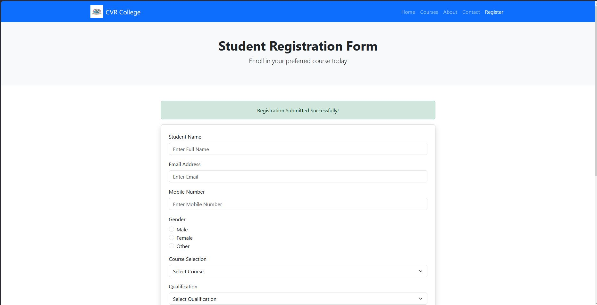
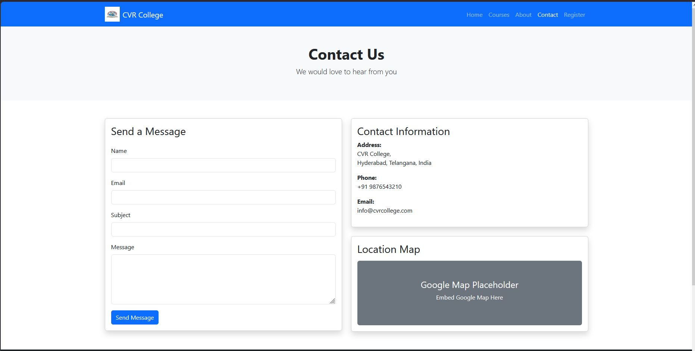

# 🎓 Online Course Registration Portal

A responsive Online Course Registration Portal built using HTML5, CSS3, and Bootstrap 5.

This project allows students to browse available courses, register online, learn about the institute, and contact the training center through a user-friendly interface.

---

## 🚀 Technologies Used

- HTML5
- CSS3
- Bootstrap 5

---

## 📌 Features

### Home Page
- Responsive Navigation Bar
- Hero Section
- Featured Courses
- Student Testimonials
- Footer

### Courses Page
- Course Listing
- Bootstrap Cards
- Responsive Grid Layout
- Registration Buttons

### Registration Page
- Student Registration Form
- Resume Upload
- Terms & Conditions
- Bootstrap Alert
- Bootstrap Modal

### About Us Page
- Institute History
- Vision
- Mission
- Faculty Information

### Contact Us Page
- Contact Form
- Contact Details
- Google Map Placeholder

---

## 📂 Project Structure

```text
Online-Course-Registration-Portal/
│
├── index.html
├── courses.html
├── registration.html
├── about.html
├── contact.html
│
├── css/
│   └── style.css
│
└── images/
    ├── banner.jpg
    ├── web.jpg
    ├── python.jpg
    ├── ds.jpg
    ├── ai.jpg
    ├── java.jpg
    ├── cloud.jpg
    ├── faculty1.jpg
    ├── faculty2.jpg
    └── faculty3.jpg
```

---

## 🔗 GitHub Repository

```text
https://github.com/your-username/college-event-management](https://github.com/mamidipakapavan02-blip/Online-Course-Registration-Portal
```
---

## 📸 Screenshots

### Home Page


### Courses Page


### Registration Page



### About Us Page


### Contact Us Page



---

## 🛠️ How to Run

1. Download the project.
2. Extract the files.
3. Open `index.html` in a browser.

---

## 👨‍💻 Developed By

**M Pavan Kumar**
**23B81A05JD**
B.Tech – Computer Science and Engineering

CVR College of Engineering

## ⭐ Project Outcome

A fully responsive Bootstrap 5 web application for managing course registrations and displaying training institute information.
